# 用户手册

## 1. 项目简介

### 核心能力

* **多格式高精解析**：集成 MinerU 智能解析工具，支持 PDF 中复杂的表格、公式及图片内容的精准提取与还原。
* **自动化知识工程**：采用分块（Chunking）策略配合大语言模型，自动从长文档中抽取实体和关系，并解决跨页截断问题。
* **原生 RAG 问答**：PDF 服务内置轻量级 RAG 检索问答能力，支持基于上传文档的即时问答。
* **文档全生命周期治理**：提供从“上传 -> 解析 -> 质量审核 -> 归档”的完整治理流程，确保进入图谱的数据质量。

---

## 2. 系统架构

本系统采用 **微服务化 + 前后端分离** 的架构设计，并使用 **共享存储**。

### 2.1 逻辑视图

系统逻辑上分为三层：表现层、业务逻辑层（双服务核心）、数据持久层。

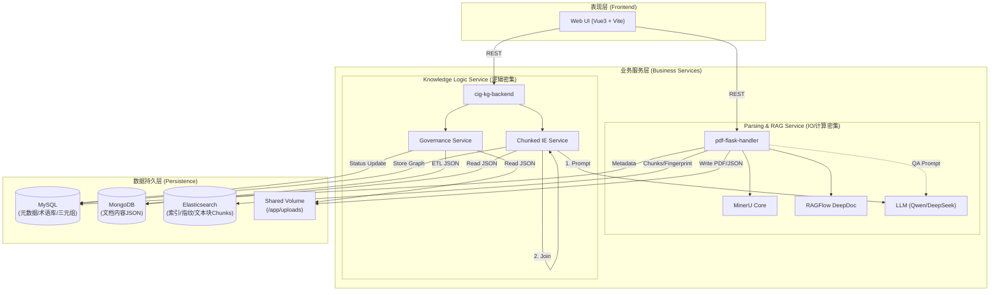

**关键设计说明：**

* **双后端模式**：
* `pdf-flask-handler` (Flask): 专职负责IO/计算密集的任务，包括文件上传流处理、调用显存密集型的 MinerU 模型进行解析。
* `cig-kg-backend` (FastAPI): 负责逻辑处理，处理复杂的业务逻辑、大模型交互、图谱构建算法及数据库事务。


* **数据流转**：文档解析结果（JSON）最初写入共享磁盘，经过治理审核后 ETL(Extract–Transform–Load) 入 MongoDB，后续知识抽取服务从 MongoDB 读取高频访问的 JSON 内容。

### 2.2 进程视图

系统运行时由以下 Docker 容器组成，它们在独立的进程空间内运行并通过 Docker Network 通信。

1. **Frontend Container** (`kg-managesystem-frontend`): Nginx 托管静态资源，反向代理 API 请求。
2. **PDF-Handler Container** (`pdf-flask-handler`):

* 运行 Gunicorn WSGI 服务器。
* 负责执行 `MinuerU` 的 PyTorch 推理进程（需独占大量 CPU/GPU 资源）。


3. **KG-Backend Container** (`cig-kg-backend`):

* 运行 Uvicorn ASGI 服务器。
* 内部包含 Python 协程池，用于并发处理大模型请求。


4. **Database Containers**: MySQL, MongoDB, Elasticsearch 独立运行。

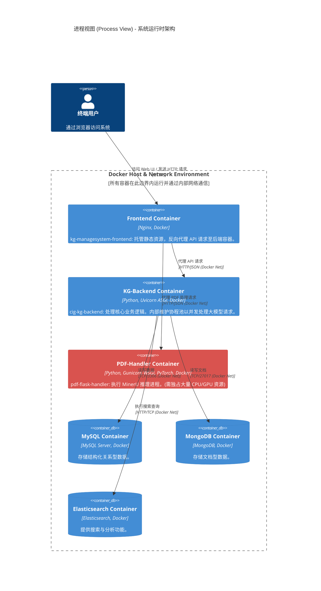


### 2.3 开发视图

代码库采用模块化组织，功能边界清晰。

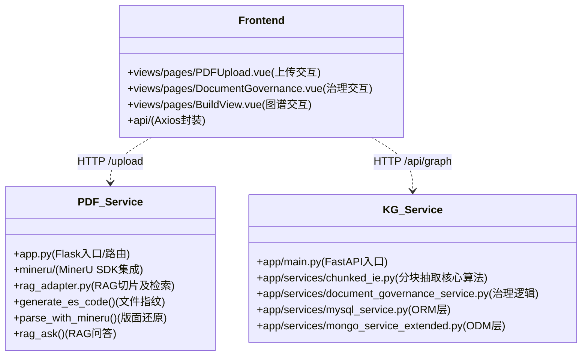

### 2.4 物理/部署视图

基于 Docker Compose 的单机微服务编排。

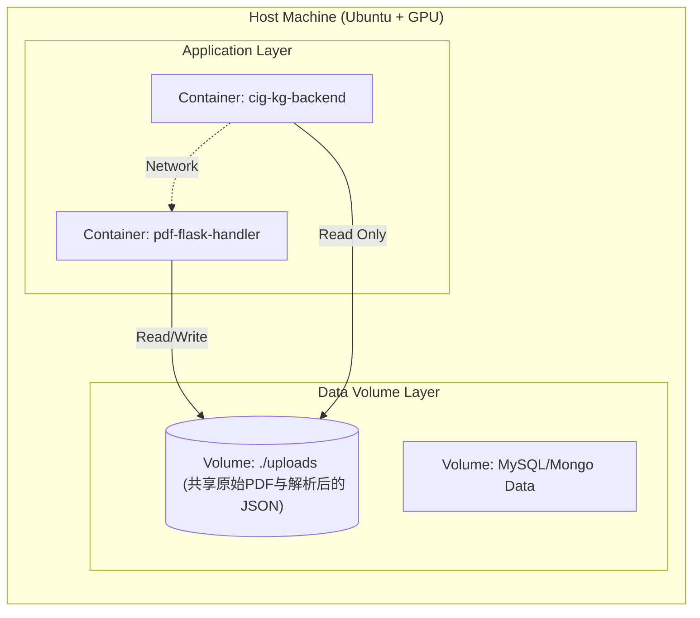

### 2.5 场景视图

**核心场景：从文档到知识图谱 & 检索增强生成(RAG)问答**

1. **用户** 上传 PDF。
2. **PDF服务** 计算 MD5 指纹，若无重复则存入磁盘。
3. **PDF服务** 执行双轨解析：
   * 启动 **MinerU** 解析，生成 `content_list.json` (包含段落、表格结构) 并写入共享卷。
   * 启动 **DeepDoc** 切片解析，将文档块存入 Elasticsearch 构建索引。
4. **用户 (可选)** 使用 `/rag/ask` 接口，系统检索文档块并基于 LLM 返回精准解答。
5. **用户** 在治理界面审核通过该文档 (Status 0 -> 1)。
6. **KG服务** (`DocumentGovernanceService`) 将 JSON 清洗并存入 MongoDB。
7. **KG服务** (`ChunkedIEService`) 从 MongoDB 读取文档内容，并将文档主要内容切分为 Chunks。
8. **KG服务** 并发调用 LLM 抽取实体关系，并执行合并算法。
9. **KG服务** 将最终的三元组存入 **MySQL** (按文档分表存储)。

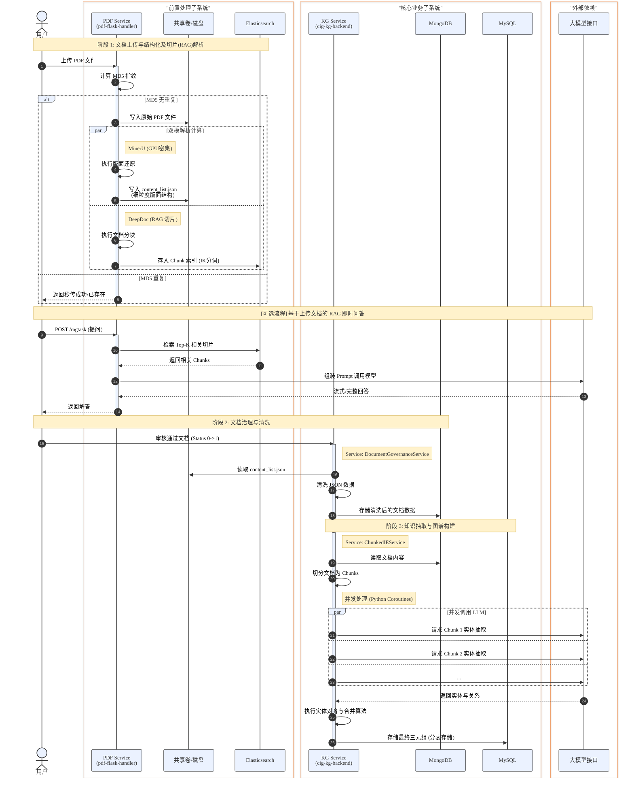


---

## 3. 项目结构

为了更好地理解代码是如何执行的，本章节按照**逻辑执行流**对各服务内部的模块进行了拆解，并辅以逻辑视图进行说明。

### 3.1 核心业务服务 (`cig-kg-backend`)

采用分层架构处理复杂的业务逻辑。本模块不仅负责图谱构建的核心算法，还承担了文档治理的业务逻辑。

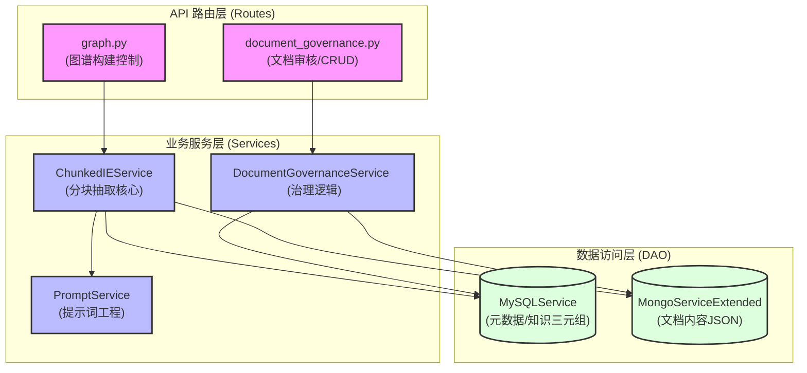

采用标准的 FastAPI 分层架构开发：

* **`app/main.py`**: 程序入口。负责初始化 DB 连接（包括 MySQL, MongoDB 的连接池）、注册路由、配置中间件（如 CORS）。
* **`app/routes/` (API 路由层)**:
  * `graph.py`: 图谱构建核心接口。仅负责接收前端的构建请求，立即返回任务状态，后台异步调用 Service 层。
  * `document_governance.py`: 文档审核接口。提供标准的 RESTful 接口用于文档的增删改查及审核状态变迁。


* **`app/services/` (业务逻辑层)**:

  * **`chunked_ie.py`**: **[系统最核心算法]**。实现了“切分-抽取-合并”算法。主要类 `ChunkedIEService` 负责从 MongoDB 读取 JSON 内容，按页切分，构造 Prompt 调用 LLM。最关键的是它维护了一个**内存级实体注册表 (EntityRegistry)**，用于在单次任务中解决跨页同名实体的 ID 统一问题。
  * `document_governance_service.py`: 协调者。它充当了一个聚合器，需要同时操作 MySQL（读取文件元数据、审核状态），文件系统（读取 MinerU 生成的 JSON 大文件）以及 MongoDB（存储审核后的 JSON），将多源数据合并给前端或下游服务。
  * `mysql_service.py` & `mongo_service.py`: 数据库操作封装。隔离具体的 SQL/NoSQL 语句，防止业务代码中散落数据库查询逻辑。


* **`app/models/schemas.py`**: 数据契约。使用 Pydantic 定义模型，确保前后端交互的数据结构严格一致 (Schema Validation)。

### 3.2 PDF 接入与解析服务 (`pdf-flask-handler`)

处理计算密集型和 IO 密集型任务。该服务独立部署的主要原因是 MinerU 解析引擎需要独占大量的 GPU/CPU 资源，且解析过程耗时较长，适合与即时响应的业务逻辑分离。

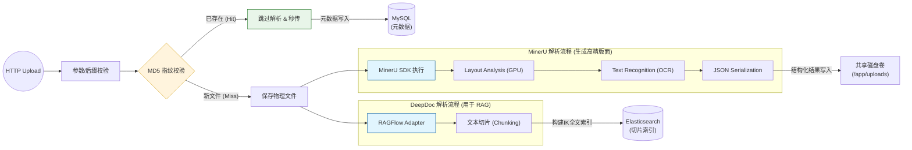

核心组件说明：

* **`app.py`**: 单文件应用入口。
  * `parse_with_mineru()`: 调用 MinerU SDK ，这是一个**阻塞式**耗时操作。
  * `parse_and_index_with_rag()`: 新增流程，调用 `rag_adapter.py` 使用 DeepDoc 进行切块和 ES 存储。
  * `init_elasticsearch()`: 启动时测试 ES 连接。
  * `/rag/ask`: 接受 QA 提问，组合问题与 ES 切片，请求 LLM 生成。

* **检索与嵌入适配器 (`rag_adapter.py`)**: 
  * 封装了 `RAGFlowPdfParser` 进行文本分片 (Chunking)。
  * 提供原生的 `_search` 能力，目前使用基于 BM25 和 `ik_max_word` 分词的倒排索引方案。
  
* **指纹机制 (`generate_es_code`)**:

  * 上传时首先计算 MD5 哈希并核对 ES 中是否已存在相同指纹，若命中则“秒传”。

* **`MinerU/` 目录**: 包含了基于 PyTorch 的版面分析模型和 OCR 模型。
* **`uploads/` 目录**: 不仅仅是上传目录，它是服务的**状态交换区**。结构为 `uploads/{library_type}/{filename}`，图谱服务会通过挂载卷读取这里的内容。

---

## 4. 功能模块

本部分详细介绍系统核心功能的执行逻辑，并辅以图表帮助理解运行时交互细节。

### 4.1 文档上传与智能解析模块

此模块不仅是文件传输，更重要的是**非结构化到结构化的转译**。系统在此阶段完成了从 PDF 二进制流到 JSON 结构化数据的核心转变。

**执行流程：**

1. **指纹去重**: 用户上传文件后，系统首先计算文件内容的 MD5 哈希，并结合 Elasticsearch 查询是否存在 `es_code`。
   * **命中**: 直接返回成功，无需解析（秒传）。
   * **未命中**: 进入后续解析流程。

2. **物理存储**: 文件被重命名为 UUID 格式（防同名覆盖），但仍沿用原始后缀保存在对应的库路径中。
3. **双轨同步解析**:
   * **MinerU 深度版面还原**: 
     - 启动 MinerU SDK加载 PDF。
     - **版面分析与OCR**: 模型识别段落、表格、图片等区域。
     - **结构化输出**: 生成 `_content_list.json`。
   * **RAGFlow DeepDoc 切片索引**: 
     - 调用 RAGAdapter 提取纯文本并将文档打散为 Chunks。
     - 存入 Elasticsearch `rag_docs_deepdoc` 索引用于全文检索。

4. **持久化**: 元数据写入 MySQL `documents` 表，版面 JSON 内容写入共享磁盘，小颗粒度分块（Chunks）存储于 Elasticsearch。

**时序交互图：**

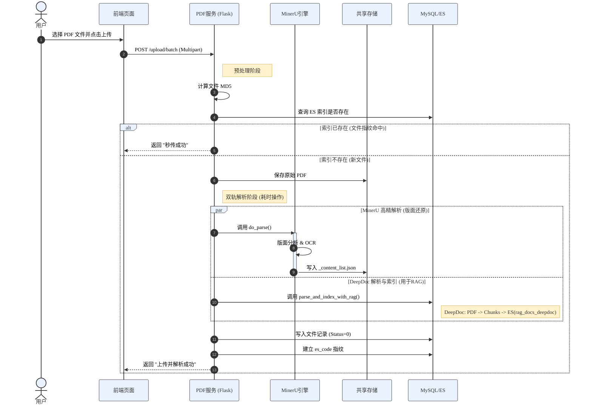

### 4.2 文档治理与审核模块

当前版本实现了以下核心治理逻辑。

**功能逻辑：**

* **状态机设计**:
  * `0 (待审核)`: 默认上传后的状态。此时文档仅存在于文件系统，未进入图谱构建队列。
  * `1 (已审核)`: 审核通过。只有此状态的文档会被**清洗入库(MongoDB)**，并允许被后续的知识抽取服务读取。
  * `2 (已删除)`: 软删除状态。MySQL 中的记录会被标记为不可用，但物理文件**暂时保留**在磁盘上，需手动清理。

* **查看详情**: 当用户点击文档详情时，后端 `DocumentGovernanceService` 会读取磁盘上的 JSON 和图片目录，将复杂的 MinerU 解析结果重新组装为前端易读的格式，供用户检查解析质量。

**状态流转图：**

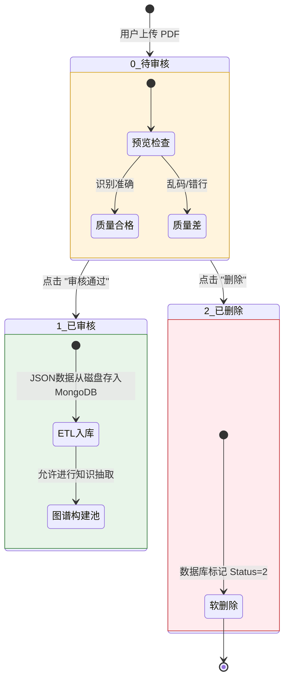

### 4.3 数据生命周期与流转机制

为了确保图谱构建的数据质量，系统采用了**“物理文件存储 + 治理数据入库”**的双轨制数据流转策略。

**核心流转逻辑图：**

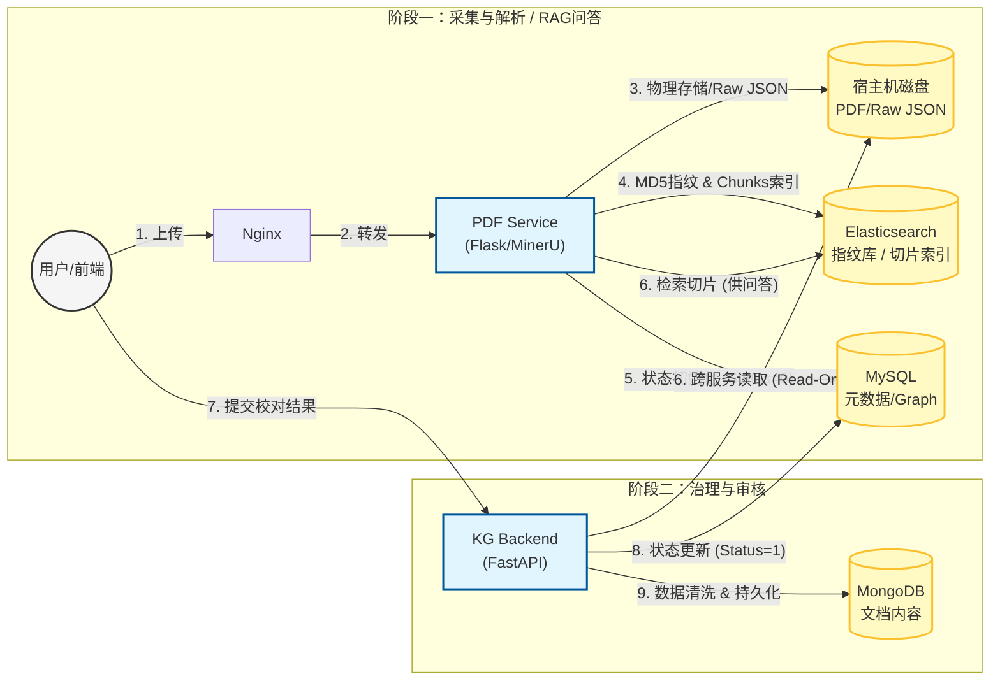

**数据存储对照表：**

| 数据对象     | 阶段   | 存储位置                            | 形式       | 主要用途              |
| ------------ | ------ | ----------------------------------- | ---------- | --------------------- |
| **原始文档** | 上传后 | 磁盘 (`/uploads/...pdf`)            | 二进制文件 | 存档 / 预览           |
| **解析初稿** | 解析后 | 磁盘 (`/uploads/mineru_...json`)    | JSON 文件  | 版面理解、中间态        |
| **文档切片** | 解析后 | **Elasticsearch** (`rag_docs_deepdoc`) | 倒排索引 | RAG 即时问答检索底座   |
| **元数据**   | 全程   | MySQL (`documents` 表)              | SQL 记录   | 状态管理              |
| **文档内容** | 审核后 | **MongoDB** (`documents_json` 集合) | BSON 文档 | 知识抽取输入源        |
| **实体关系** | 抽取后 | **MySQL** (`knowledge_{doc} 表`)    | SQL 记录   | **知识图谱/可视化展示** |

### 4.4 智能问答与 RAG (Retrieval-Augmented Generation) 模块

除了基于 MinerU 的图谱解析流，系统还在 `pdf-flask-handler` 服务中深度集成并引入了开源项目 **RAGFlow** (来自 `infiniflow/ragflow`) 的核心能力，提供基于文档内容的智能问答（RAG）功能。

#### 4.4.1 RAG 原理浅析

RAG（检索增强生成）是一种结合了**信息检索**和**大语言模型（LLM）生成**的技术，主要分为三个核心步骤：
1. **深度文档解析 (Parsing)**：使用 RAGFlow 提供的核心引擎（DeepDoc），对复杂的 PDF 文档进行版面分析、OCR 与分块（Chunking），提取出高质量的段落和表格碎片。
2. **构建索引 (Indexing)**：将解析出的 Chunk 存入 Elasticsearch，借助 IK 分词器构建倒排索引，使得文本具备高效检索能力。
3. **检索与生成 (Retrieval & Generation)**：当用户输入问题时，系统首先在 Elasticsearch 中检索出最相关的 `Top-K` 个文档块作为“上下文”，将其与用户问题一起拼装成 Prompt 提交给 LLM（如 Qwen），从而生成具备事实依据的精准回答，有效降低大模型的“幻觉”。

#### 4.4.2 系统整合方式

在本项目中，RAG 模块被解耦并内嵌于负责 IO/计算密集的 `pdf-flask-handler` 服务中，具体整合机制如下：

* **核心依赖集成**：系统在构建 Docker 镜像时，通过本地源码方式引入了 RAGFlow 的核心模块，并预置下载了所需的深度学习模型（如 `InfiniFlow/deepdoc` 版面/OCR 模型和用于文本拼接的 `text_concat_xgb` 树模型），确保离线状态下的解析能力。
* **适配层设计 (`RAGAdapter`)**：后端代码封装了 `RAGAdapter` 适配器类，作为沟通 RAGFlow 的 `RAGFlowPdfParser` 组件与 Elasticsearch 检索引擎的桥梁。
* **双轨解析策略**：系统在进行常规解析时，可调用 DeepDoc 完成 PDF 到 Chunk 的转换，并通过批量写入接口存储至 Elasticsearch（默认索引名 `rag_docs_deepdoc` ）。
* **API 服务流 (`/rag/ask`)**：提供标准的 HTTP 问答接口，接收用户提问后：
  1. 向 Elasticsearch 发起全文检索，召回相关片段。
  2. 动态组装上下文（Context）。
  3. 调用远端/本地的兼容 OpenAI 规范的大语言模型（如阿里云千问 `qwen-plus`），流式返回 RAG 增强后的解答。

**RAG 模块交互时序图：**

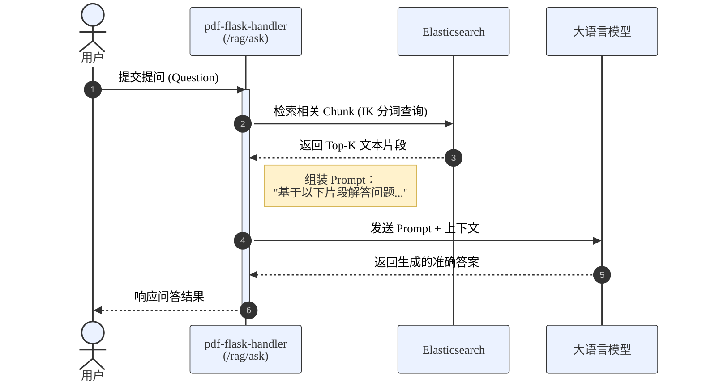

---

## 5. 快速上手

### 5.1 环境准备

部署前请确保服务器满足以下要求：

* **操作系统**: Linux (Ubuntu 20.04+, CentOS 7+)。
* **容器环境**: Docker (>= 20.10), Docker Compose (>= 2.0.0)。
* **硬件资源**: 建议至少 8GB 内存 (MinerU 解析服务与 ES 较为耗费资源)。
* **端口检查**: 确保以下端口未被占用：`8080` (前端), `8000` (后端), `8001` (PDF服务), `3306` (MySQL), `27017` (Mongo), `9200` (ES)。

### 5.2 配置文件 (.env)

在项目根目录下创建或更新 `.env` 文件。首次部署请务必检查以下关键配置：

```ini
# --- 基础数据库配置 ---
MYSQL_ROOT_PASSWORD=root
MYSQL_DATABASE=document
MYSQL_PORT=3306
MYSQL_HOST=mysql

MONGO_INITDB_ROOT_USERNAME=root
MONGO_INITDB_ROOT_PASSWORD=root
MONGO_PORT=27017

ELASTICSEARCH_PORT=9200
ES_JAVA_OPTS=-Xms512m -Xmx512m

# --- 服务端口与基础配置 ---
PDF_SERVICE_PORT=8001
KG_SERVICE_PORT=8000
FRONTEND_PORT=8080
CORS_ORIGINS=http://localhost:5173,http://localhost:3000

# --- LLM 配置 (核心业务) ---
# 用于图谱构建的大模型配置 (支持兼容 OpenAI 格式的接口)
API_KEY=your_api_key_here
BASE_URL=https://api.deepseek.com
MODEL_NAME=deepseek-chat
# 若使用 Qwen (阿里千问):
# QWEN_API_KEY=sk-xxxx
# QWEN_API_BASE=https://dashscope.aliyuncs.com/compatible-mode/v1

# --- 初始化开关 ---
# 首次启动设为 true 以执行数据库初始化脚本，之后建议改为 false
INIT_DB_ON_STARTUP=true
```

### 5.3 部署流程

为了保证服务依赖关系正确，建议按照以下顺序启动服务：

**步骤 1：启动基础依赖服务**
首先启动数据库和搜索引擎，等待其初始化完成。

```bash
docker compose up -d mysql mongo elasticsearch
```

**步骤 2：启动后端业务服务**
待数据库准备就绪后，启动核心业务后端与 PDF 解析服务。

```bash
docker compose up -d cig-kg-backend pdf-flask-handler
```

**步骤 3：启动前端服务**
最后启动 Web 前端。

```bash
docker compose up -d kg-managesystem-frontend
```

> **注意**：也可以使用 `docker-compose up -d --build` 一键启动，但需关注日志确保后端在连接数据库时未超时。

### 5.4 服务状态验证

部署完成后，请等待约 1-2 分钟，并检查以下服务入口以验证系统是否正常运行：

| 服务名称          | 访问地址                     | 预期结果                                       |
| ----------------- | ---------------------------- | ---------------------------------------------- |
| **前端管理系统**  | `http://localhost:8080`      | 显示系统登录页或仪表盘。                       |
| **后端 API 文档** | `http://localhost:8000/docs` | 能够打开 Swagger UI 页面，且无报错弹窗。       |
| **PDF 解析服务**  | `http://localhost:8001`      | 返回 404 或欢迎信息 (表明服务存活)。           |
| **Elasticsearch** | `http://localhost:9200`      | 返回包含版本信息的 JSON (需在服务器本地测试)。 |
